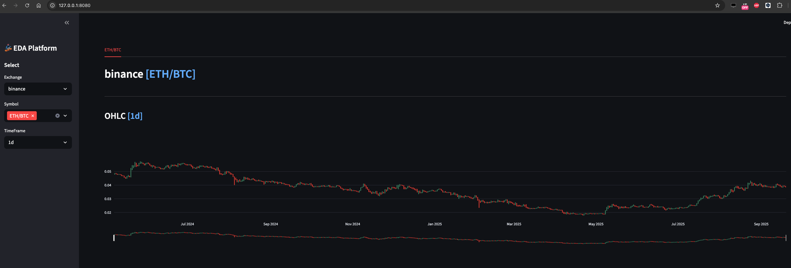
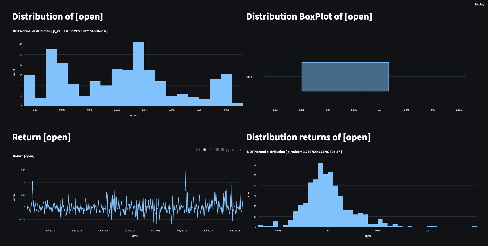
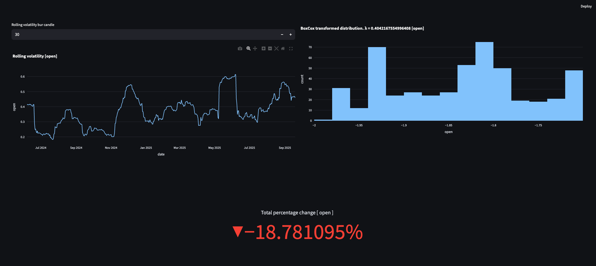
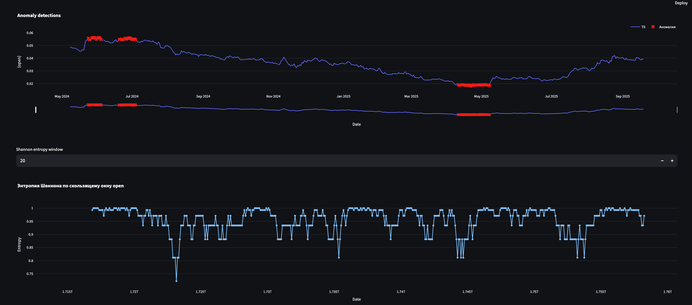
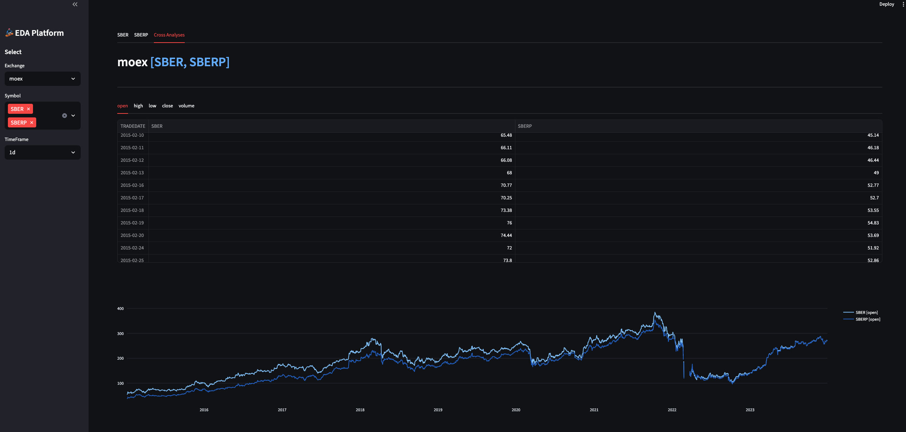

# EDA platform [Trading Info]

## Descriptions
EDA platform for trading information

Features:
- Load data from various sources (crypto, stock)
- Visualize data (OHLC)
- Analyze data using statistical methods
- Detect anomalies in data
- Perform cross-analyses on data

### Install / RUN


```commandline
docker-compose up

# open browser
=> http://127.0.0.1:8080/
```

or

```commandline
docker build -t eda_plat -f Dockerfile .
docker run -p 8080:8080 -it eda_plat

# open browser
=> http://127.0.0.1:8080/
```

or

```bash
streamlit run eda_platform/main.py

# Run
open web localhost:8080
```


### Example

#### OHLC View


#### Stat Info


#### Rolling Volatility


#### Anomaly Detection


#### Cross Analyses

